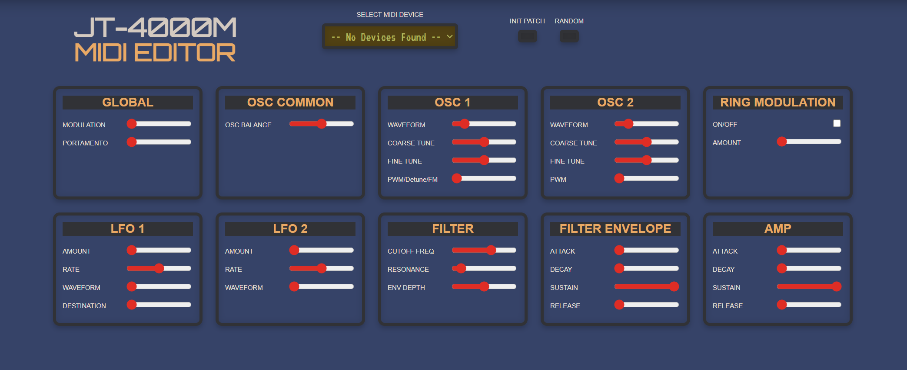
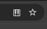
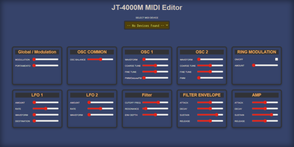
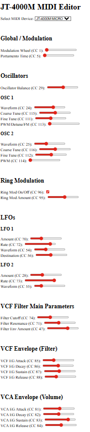
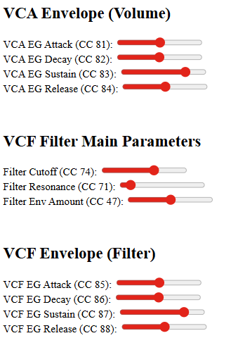
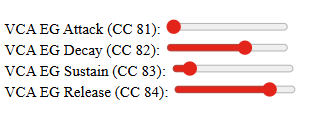
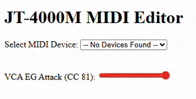
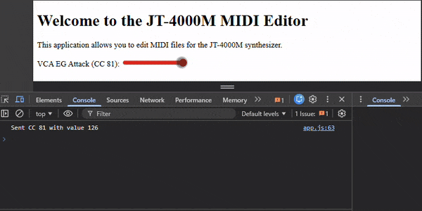
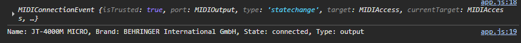

"# JT4000M-MIDI-EDITOR" 

Try it here: https://www.behringer-jt4000m-editor.co.uk/

V1.02 - Graphics Update

Older Version:

To access MIDI in the browser you might need to enable the following button (found at the right of the browser URL):

-Tested on Chrome
-To save a patch, just press down on the pot of JT4000

_____________________________________________

UPDATES:

_____________________________________________

All available MIDI controls now added:

_____________________________________________

All available MIDI controls now added:

_____________________________________________

Added more controls:

_____________________________________________

full VCA ENV now available:

_____________________________________________

User can now select correct MIDI device (helpful if using more than one):

_____________________________________________

We can now control the Attack Envelope via the browser:

_____________________________________________

Browser is detecting MIDI from JT4000:

